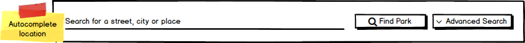
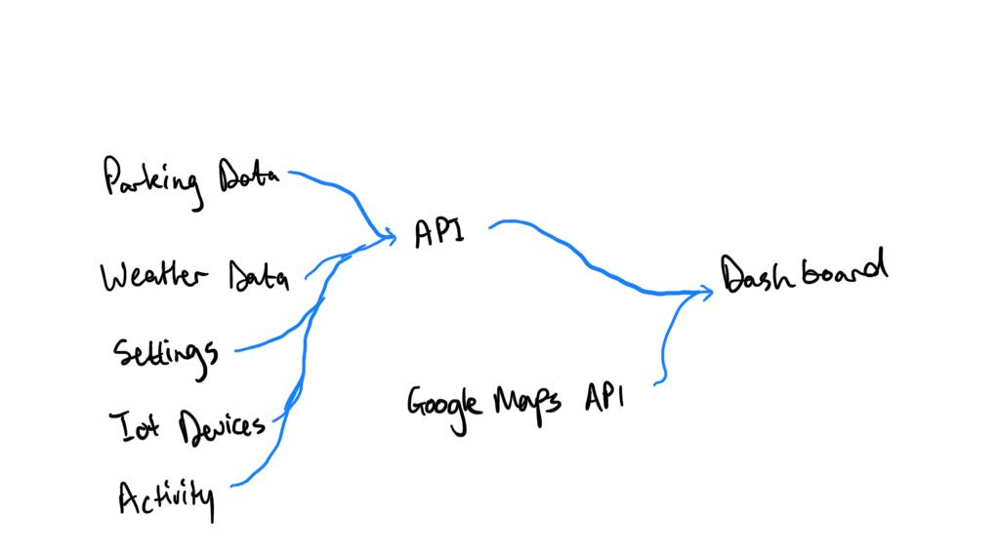

# SIT 311 GROUP PROJECT
### Members: 
---
| Name     | Job          | 
| ------------- |:-------------:|
| Tim Tattersal      | Dashboard (Front End) | 
| Marshal Welgama    | Backend API      | 
| Mehul Warde | Backend API      | 
| Greg Macintyre | AWS IOT      | 

### Front End:
---
- Angular Js
- Do not make any changes to code
- Any requests, recomendations speak to Tim first 

#### Peview
###### Main Interface

.png)
.png)
###### Find Parking

.png)
.png)
###### Search Box

.png)


### Back End:
---

#### Weather Data

><center>For the weather data we will be using the darksky.net API since it is very inutuitive<center>


You will need to get an account and make API calls

Example: 

```
GET https://api.darksky.net/forecast/0123456789abcdef9876543210fedcba/<insert co-ordinates>

This example used my API key
```

> Possible write sample endpoints

#### Parking Data
talk about shit here

#### IOT Devices
talk about more shit


